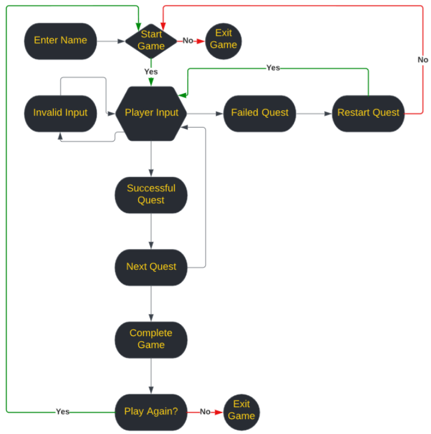

# Guild Wars

## About

1. This adventure text based game is based on the MMORPG game Guild Wars, which was created by ArenaNet.
2. It has been built using python and text files.

## Project Goals

### Usage

1. This game was primarily built for people who enjoy the game Guild Wars and would like to play for nostalgia reasons
2. People that enjoy adventure story games.
3. In the game there is basic yes and no answer, but also little games to play to complete quests and beat bosses.

### Site Owner Goals

1. I wanted to have a clean game that was easy to read and follow.
2. I wanted to have various elements to the game to keep the player interested.
3. I wanted to stop any invalid entries ruining the game.
4. I wanted a restart function for each quest so they player doesn't have to keep starting over.

### Design

1. Title is yellow as it is a near color to the Guild Wars original title.
2. General text is white as it looks clean and easy to read against a black background.

### Features

1. Player can enter their name.
2. Some quests require a Y or N answer.
3. Some quests involve mini-games to beat.
4. Restart quest option if wrong choice is picked or player loses a mini-game.
5. Restart game if the game is completed.

## Site Design

### Flow chart

